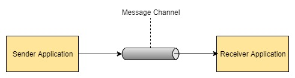

# Research Assignment: Study of Enterprise Integration Patterns

## Message Channel
The "Message Channel" is diagrammed the following way:



Message channel is a way, or a tube so to speak, which different application can send messages through to each other. Message channels are often combined with other EIP patterns in order to transform the data in different ways.

Message channels, as briefly touched upon, can help setting up data transformation between applications. Often when integrating different applications, they send messages in a specific format, whilst the other application might expect them in another format. Message Channels plays a crucial part in such transformations.

Message Channel are defined by a set of rules/guide lines which should be followed when desgining a channel. 

Message Channels are essential when integrating applications, that need to send, receive or exchange messages.

In [spring](https://docs.spring.io/spring-integration/docs/5.0.1.RELEASE/reference/html/messaging-channels-section.html) Message Channels are defined the following way:

```
public interface MessageChannel {

    boolean send(Message message);

    boolean send(Message message, long timeout);
}
```

This implementation returns true if the message is delivered successfully, or false if the messages is interupted or times out.
